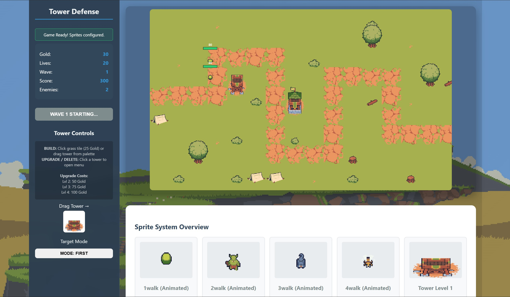

# 🏰 Tower Defense Game

A simple browser-based **Tower Defense game** built with **HTML, CSS, and JavaScript**.  
The game features enemy pathfinding, tower placement, and shooting mechanics.  

---

## 🎮 Gameplay Screenshot

---

## ✨ Features
- Drag & drop tower placement  
- Upgrade or delete towers via context menu  
- Multiple targeting modes (first, strongest, weakest)  
- Enemy waves with increasing difficulty  
- Pixel-art assets for towers and enemies  

---

## 📦 Assets
This project uses free assets from [Craftpix.net](https://craftpix.net/freebies/free-archer-towers-pixel-art-for-tower-defense/?num=1&count=43&sq=tower%20defence&pos=7).  
All credits for artwork go to **Craftpix**.  

---

## 🚀 How to Run
1. Clone or download this repository  
2. Open `index.html` in a browser  
3. Enjoy the game!  

---

## 📜 License
This project is for **educational purposes only**.  
Assets are licensed under Craftpix’s free license terms.  
